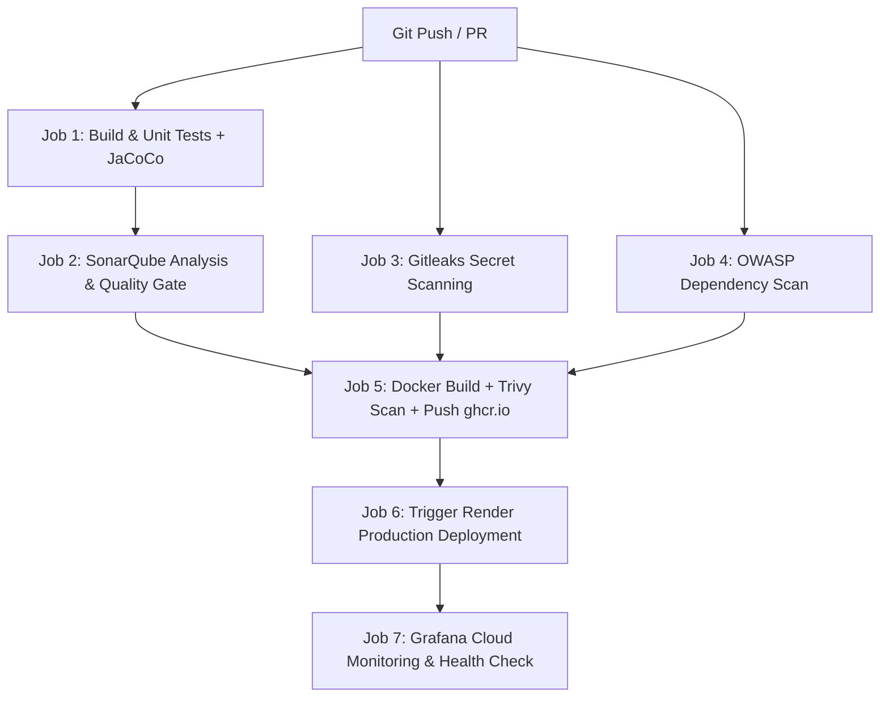

# 🚀 Guide de Configuration CI/CD Complet — The Bridge Backend

Ce document contient le guide complet pour configurer et exécuter l'ensemble de la chaîne **CI/CD**, **SonarQube**, **Docker**, **Kubernetes (Minikube)**, **Prometheus**, **Grafana** et **Render**.

---

## 🌐 URLs de l'Application

- **Frontend (Vercel)** : [https://9antra-the-bridge-frontend-pdjd-silk.vercel.app/](https://9antra-the-bridge-frontend-pdjd-silk.vercel.app/)
- **Backend (Render)** : [https://nineantra-the-bridge-backend.onrender.com](https://nineantra-the-bridge-backend.onrender.com)

---

## 🔑 1. Secrets GitHub Actions à Configurer

Pour que le pipeline GitHub Actions (`.github/workflows/ci.yml`) s'exécute sans erreurs, vous devez ajouter les secrets suivants dans votre dépôt GitHub :

👉 **Chemin dans GitHub** : `Settings` ➔ `Secrets and variables` ➔ `Actions` ➔ `New repository secret`

### A. Secrets Requis / Recommandés

| Nom du Secret | Description / Exemple | Utilité |
| :--- | :--- | :--- |
| `SONAR_TOKEN` | Jeton d'accès généré depuis SonarCloud/SonarQube | Analyse de code SonarQube |
| `SONAR_HOST_URL` | `https://sonarcloud.io` (par défaut) ou votre serveur | URL de l'instance SonarQube |
| `RENDER_DEPLOY_HOOK_URL` | `https://api.render.com/deploy/srv-xxxx?key=yyyy` | Déclenchement automatique du déploiement sur Render (Recommandé) |
| `RENDER_API_KEY` | Jeton API Render (`rnd_...`) | Optionnel (si non-utilisation du Deploy Hook) |
| `RENDER_SERVICE_ID` | ID du service Render (`srv-...`) | Optionnel (si non-utilisation du Deploy Hook) |
| `GRAFANA_CLOUD_URL` | `https://<votre-org>.grafana.net` | URL de votre instance Grafana Cloud |
| `GRAFANA_CLOUD_API_KEY` | Jeton API ou Service Account Token Grafana Cloud (rôle Editor) | Envoi d'annotations de déploiement et synchronisation de dashboards |
| `MONITORING_USERNAME` | `monitoring_admin` (par défaut) | Utilisateur HTTP Basic pour scraper `/actuator/prometheus` (Render env) |
| `MONITORING_PASSWORD` | Mot de passe sécurisé | Mot de passe HTTP Basic pour scraper `/actuator/prometheus` (Render env) |
| `DOCKERHUB_USERNAME` | Nom d'utilisateur Docker Hub | Optionnel (si push sur Docker Hub) |
| `DOCKERHUB_TOKEN` | Jeton / Mot de passe Docker Hub | Optionnel (si push sur Docker Hub) |
| `NVD_API_KEY` | Clé API NIST NVD | Optionnel (Accélère les scans de vulnérabilités OWASP) |

> ℹ️ **Note** : Le pipeline utilise par défaut **GitHub Container Registry (`ghcr.io`)** via le jeton automatique `${{ secrets.GITHUB_TOKEN }}`. Aucun secret supplémentaire n'est requis pour publier l'image Docker sur `ghcr.io`.

---

## 🐳 2. Commandes Docker

### A. Builder l'image Docker localement
```bash
docker build -t the-bridge:latest .
```

### B. Lancer le conteneur Backend localement avec fichier .env
```bash
docker run -d \
  --name the-bridge-backend \
  -p 8080:8080 \
  -p 8081:8081 \
  --env-file .env \
  the-bridge:latest
```

### C. Lancer la pile de Monitoring Local (Prometheus + Grafana)
```bash
docker compose -f docker-compose.monitoring.yml up -d
```
- **Grafana** : [http://localhost:3000](http://localhost:3000) (Identifiants : `admin` / `admin`)
- **Prometheus** : [http://localhost:9090](http://localhost:9090)
- **Métriques Spring Actuator** : [http://localhost:8081/actuator/prometheus](http://localhost:8081/actuator/prometheus)

---

## ☸️ 3. Déploiement Kubernetes avec Minikube

### A. Démarrer Minikube
```bash
minikube start --driver=docker
```

### B. Exécuter le Déploiement Automatique
- **Sur Windows (PowerShell)** :
```powershell
.\k8s\deploy-minikube.ps1
```
- **Sur Linux / macOS (Bash)** :
```bash
chmod +x k8s/deploy-minikube.sh
./k8s/deploy-minikube.sh
```

### C. Déploiement Manuel étape par étape avec `kubectl`
```bash
# 1. Créer le namespace
kubectl apply -f k8s/namespace.yaml

# 2. ConfigMap & Secret
kubectl apply -f k8s/configmap.yaml
kubectl apply -f k8s/secret.example.yaml # ou votre secret.yaml personnalisé

# 3. Application Backend
kubectl apply -f k8s/deployment.yaml
kubectl apply -f k8s/service.yaml

# 4. Prometheus & Grafana sur Kubernetes
kubectl apply -f k8s/monitoring/prometheus-configmap.yaml
kubectl apply -f k8s/monitoring/prometheus-deployment.yaml
kubectl apply -f k8s/monitoring/grafana-deployment.yaml
```

### D. Accéder aux services Minikube
```bash
# Accéder à l'application Backend
minikube service the-bridge-service -n the-bridge

# Accéder au dashboard Grafana sur Kubernetes
minikube service grafana-service -n the-bridge

# Accéder à Prometheus sur Kubernetes
minikube service prometheus-service -n the-bridge
```

---

## 📊 4. Configuration SonarQube / SonarCloud

Le projet est configuré dans le fichier [`sonar-project.properties`](sonar-project.properties).

Pour activer SonarCloud :
1. Créez un compte et un projet sur [SonarCloud.io](https://sonarcloud.io).
2. Récupérez votre **Sonar Token**.
3. Dans GitHub, ajoutez le secret `SONAR_TOKEN`.
4. Ajoutez la variable `SONAR_ORGANIZATION` (ou configurez-la dans GitHub Variables).

L'analyse vérifie automatiquement les tests unitaires et la couverture de code **JaCoCo**.

---

## ☁️ 5. Déploiement sur Render

1. Connectez-vous sur [Render.com](https://render.com).
2. Rendez-vous sur votre Web Service : `nineantra-the-bridge-backend`.
3. Dans **Settings** ➔ **Deploy Hook**, copiez l'URL unique du Deploy Hook (`https://api.render.com/deploy/srv-xxxx?key=yyyy`).
4. Ajoutez cette URL dans GitHub Secret sous le nom `RENDER_DEPLOY_HOOK_URL`.
5. À chaque `git push` sur la branche `main` (ou `master` / `aziz`), GitHub Actions va automatiquement :
   - Vérifier les tests unitaires & la couverture
   - Exécuter l'analyse SonarQube & Gitleaks
   - Builder l'image Docker & scanner la sécurité avec Trivy
   - Publier l'image Docker
   - Déclencher le déploiement de la version backend sur Render.

---

## 📈 6. Configuration Grafana Cloud (Monitoring & Observabilité)

1. Créez un compte gratuit sur [Grafana Cloud](https://grafana.com/products/cloud/).
2. Récupérez l'URL de votre instance (ex: `https://votre-compte.grafana.net`).
3. Créez un **Service Account Token** :
   - Dans Grafana Cloud : `Administration` ➔ `Users and access` ➔ `Service accounts`.
   - Cliquez sur **Add service account**, donnez-lui un nom (ex: `github-actions-ci`) et le rôle **Editor**.
   - Cliquez sur **Add service account token**, copiez la clé générée.
4. Dans GitHub Secrets :
   - Ajoutez `GRAFANA_CLOUD_URL` : l'URL de votre instance Grafana Cloud.
   - Ajoutez `GRAFANA_CLOUD_API_KEY` : la clé du Service Account.
5. À chaque déploiement réussi sur Render :
   - Le pipeline teste la santé du Backend en production (`/actuator/health`).
   - Le pipeline publie automatiquement une **annotation de déploiement** sur vos dashboards Grafana Cloud avec le commit, la branche et le lien de l'action GitHub.
   - Le pipeline synchronise automatiquement le dashboard Spring Boot (`docker/grafana/provisioning/dashboards/spring-boot-dashboard.json`).

---

## ⚙️ Résumé du Pipeline GitHub Actions



✅ **Système prêt, modulaire et totalement automatisé !**
